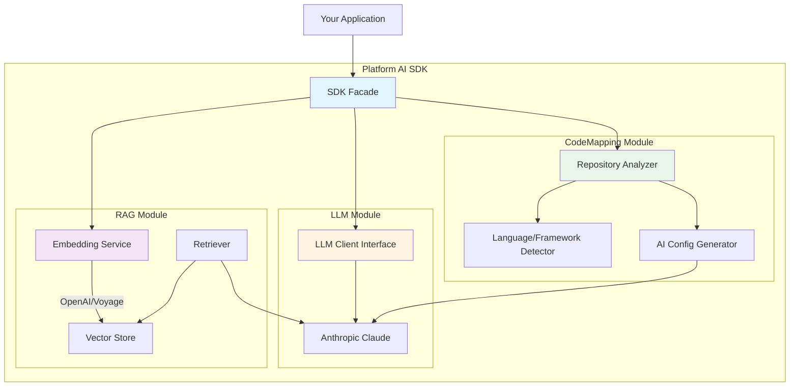

# Platform AI SDK - Quick Context

**Last Updated:** 2025-10-19

## What It Is

Go SDK for AI-powered platform engineering. Analyzes code, generates platform configs, and provides RAG capabilities using Claude AI.

## Architecture



## Key Architectural Decisions

### 1. Interface-Based Design (Dependency Inversion)
- All modules depend on abstractions (`llm.Client`, not `AnthropicClient`)
- Easy to swap providers without changing downstream code
- Testable via mocks/stubs

### 2. Modular Bounded Contexts
- **LLM:** AI provider abstraction (currently Anthropic)
- **CodeMapping:** Repository analysis + config generation
- **RAG:** Semantic search with custom knowledge bases
- Each module is independent and can be used separately

### 3. Factory Pattern for Construction
- `NewModule()` factory functions for all modules
- Constructor injection for dependencies
- No global state

### 4. In-Memory Vector Store (YAGNI)
- Current scale doesn't require persistent DB
- Fast, simple, sufficient for <10K documents
- Will migrate to persistent store when needed

### 5. Context-First Design
- All operations accept `context.Context`
- Supports cancellation and timeouts
- Default 60s timeout for LLM calls

## Current Sprint: Core SDK Stability

**Focus Areas:**
- ✅ Core SDK architecture established
- ✅ RAG module implemented
- ✅ Code analysis working
- ⚠️ **Testing needed** (currently 0% coverage)
- ⚠️ **Verification scripts** to be added
- 🔄 **Performance optimization** for large repos

**Recently Completed:**
- RAG module with multi-provider embedding support (OpenAI, Voyage AI)
- Code-to-platform mapping with AI-powered config generation
- Multi-language detection (Go, Node.js, Python, Rust, Java, Ruby, PHP)
- Framework detection (Gin, Express, FastAPI, etc.)
- CLI examples for code analysis and RAG demo

## Quick Start

```bash
# Install
go get github.com/philipsahli/innominatus-ai-sdk

# Setup
export ANTHROPIC_API_KEY="your-key"
export OPENAI_API_KEY="your-key"  # for RAG

# Use
sdk, _ := platformai.New(ctx, &platformai.Config{...})
result, _ := sdk.CodeMapping().Analyze(ctx, req)
```

## Common Commands

| What | Command |
|------|---------|
| Build | `go build ./...` |
| Test | `go test ./...` |
| Format | `gofmt -w .` |
| Lint | `golangci-lint run` |
| Security | `gosec ./...` |
| Examples | `cd examples/code-analyzer && go build` |

## Project Stats

- **Language:** Go 1.24.1
- **Modules:** 3 (llm, codemapping, rag)
- **Dependencies:** 4 direct, 2 indirect
- **Examples:** 2 (code-analyzer, rag-demo)
- **Test Coverage:** 0% (needs improvement)

## Key Files

| File | Purpose |
|------|---------|
| `pkg/platformai/sdk.go` | Main SDK entry point |
| `pkg/platformai/llm/client.go` | LLM abstraction interface |
| `pkg/platformai/codemapping/module.go` | Code analysis module |
| `pkg/platformai/rag/module.go` | RAG module |
| `examples/code-analyzer/main.go` | CLI tool for repo analysis |
| `examples/rag-demo/main.go` | RAG usage example |

## Environment Variables

- `ANTHROPIC_API_KEY` - Required for LLM operations
- `OPENAI_API_KEY` - Required if using OpenAI embeddings
- `VOYAGEAI_API_KEY` - Required if using Voyage AI embeddings

## Known Limitations

- In-memory vector store (not persistent)
- No distributed/multi-instance support yet (YAGNI)
- Large repos (>10K files) may be slow
- Subject to Anthropic API rate limits

## Next Steps

1. Add comprehensive test suite (unit + integration)
2. Create verification scripts for each module
3. Performance profiling for large repositories
4. Consider persistent vector store when scale requires it

---

**Philosophy:** SOLID + KISS + YAGNI + Minimal Documentation
